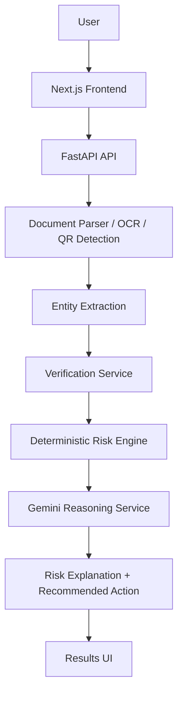

# UNMASK AI

> **See beyond the message. Verify the identity.**

UNMASK AI is a multimodal cybersecurity verification system that analyzes suspicious digital communications such as documents, images, URLs, phone numbers, and QR codes. It extracts evidence, checks identity/contact consistency, detects social-engineering signals, calculates a deterministic risk level, and uses Gemini AI to provide an evidence-based explanation and safer recommended action.


---

## 1. Problem

Modern digital communications—such as PDF invoices, notification screenshots, scanned notices, and image attachments—are primary entry points for social engineering and impersonation attacks.

Key challenges in digital threat verification include:
* **Multi-Format Delivery**: Scams arrive across PDFs, screenshots, raster images, embedded QR codes, URLs, and phone numbers.
* **Organizational Impersonation**: Attackers masquerade as legitimate financial institutions, delivery services, and service providers using official logos and brand names.
* **Hidden Evidence**: Critical indicators like support hotlines, domain URLs, and QR code destinations are embedded inside documents and images rather than plain text.
* **Inadequate Binary Answers**: Simple "scam / not scam" classifications lack transparency, contextual detail, and verification proof.
* **Lack of Actionable Guidance**: Users need understandable evidence and a clear, safer next action to avoid taking bait.

---

## 2. Solution

UNMASK AI approaches digital threat analysis through a core security philosophy:

$$\text{Evidence} \longrightarrow \text{Verification} \longrightarrow \text{Explanation} \longrightarrow \text{Action}$$

The system performs automated analysis across five core layers:
1. **Evidence Extraction**: Extracts structural text, contact phone numbers, URLs, and embedded QR codes from documents and images.
2. **Consistency Verification**: Cross-checks extracted contact information and domains against reference data.
3. **Signal Detection**: Identifies coercive framing, urgency language, credential verification requests, and payment prompts.
4. **Deterministic Scoring**: Calculates a transparent risk score and risk category (`SAFE`, `SUSPICIOUS`, `HIGH RISK`).
5. **AI Explanation & Action**: Uses Google Gemini to explain findings in human terms and recommend safer next steps.

---

## 3. Key Features

* **Document & Image Analysis**: Processes digital PDF documents and common image formats (`PNG`, `JPG`, `JPEG`).
* **OCR Text Extraction**: Employs Tesseract OCR for text extraction from scanned documents and raster images.
* **PDF Text Extraction**: Uses PyMuPDF (`fitz`) for fast text and layout parsing from native PDF files.
* **Phone Number Extraction & Verification**: Extracts global contact numbers and checks consistency against registered organization numbers.
* **URL & Domain Analysis**: Extracts embedded links, parses hostnames, and checks domain consistency and structural anomalies.
* **QR Code Detection & Parsing**: Uses OpenCV (`cv2`) to detect and decode embedded single or multi-QR code destinations.
* **Organization / Entity Extraction**: Detects claimed organization names in document text.
* **Social-Engineering Detection**: Identifies high-pressure urgency language, credential prompts, and payment transfer requests.
* **Deterministic Risk Scoring**: Applies rule-based scoring to prevent AI hallucination from determining risk severity.
* **Gemini AI Evidence-Based Explanation**: Generates structured, transparent security summaries and key findings using the Google Gemini API.
* **Standardized Risk Categories**: Evaluates threats into clear `SAFE`, `SUSPICIOUS`, and `HIGH RISK` buckets.
* **UNVERIFIED Identity Handling**: Treats unknown entities as unverified without falsely labeling them malicious.
* **Fallback AI Provider**: Includes a local mock reasoning provider for offline testing or when an API key is unconfigured.
* **Interactive Results & History UI**: Web interface built with Next.js displaying evidence cards, verification matrices, link breakdowns, and scan history.

---

## 4. How It Works

### Analysis Pipeline

1. **Input**: User uploads a PDF document or image file (`PNG`, `JPG`, `JPEG`).
2. **Text & Evidence Extraction**: PDF text is parsed natively via PyMuPDF; image text is extracted via Tesseract OCR; QR codes are decoded via OpenCV.
3. **Contact / URL / QR Analysis**: Regex and parsing routines extract phone numbers, URLs, domain names, and QR destinations.
4. **Verification**: Extracted entities are cross-checked against available trusted reference data.
5. **Risk Scoring**: The deterministic risk engine evaluates rules (mismatches, urgency, lookalikes) to compute a score.
6. **Gemini Reasoning**: Structured evidence payload is passed to Gemini AI (or local fallback) to formulate a clear, non-technical report.
7. **Recommended Action**: Actionable recommendations are delivered to help the user handle the communication safely.

### System Architecture



---

## 5. Risk Assessment

The deterministic risk engine calculates risk scores objectively by evaluating rule-based indicators:

| Signal Category | Signal Trigger | Score Weight |
| :--- | :--- | :--- |
| **Contact Mismatch** | Extracted phone number conflicts with official organization contact | +3 |
| **Domain Mismatch** | Extracted domain conflicts with official organization domain | +3 |
| **QR Destination Mismatch** | QR code URL destination conflicts with official domain | +3 |
| **Lookalike Domain** | Domain resembles official domain with subtle variations | +2 |
| **Payment / Transfer Request** | Message prompts for fund transfers or financial payments | +2 |
| **Credential Request** | Message prompts to verify passwords or account details | +2 |
| **Urgency Framing** | High-pressure language demanding immediate action | +1 |
| **URL Structural Anomaly** | IP-based hostname, excessive subdomains, or suspicious TLD | +1 |
| **Verified Contact** | Phone number matches official registered contact | -1 |
| **Verified Domain** | Domain matches official registered domain | -1 |
| **Verified QR** | QR destination matches official registered domain | -1 |

### Risk Categories

* **SAFE** (Score $\le 2$): Low-risk indicators; communication details are consistent with reference data.
* **SUSPICIOUS** (Score $3 - 5$): Unverified links, urgency language, or unknown entity contact details present.
* **HIGH RISK** (Score $\ge 6$): Confirmed contact/domain mismatches, lookalike domains, or coercive credential/payment demands.

> **Role of Gemini AI**: Google Gemini **does not** compute or alter the deterministic risk score or level. It receives the structured evidence payload to generate human-readable explanations, key findings summaries, and recommended actions.

---

## 6. Verification Philosophy

UNMASK AI uses four distinct status classifications for extracted entities:

* **VERIFIED**: Supporting reference data confirms that the extracted contact or domain matches the claimed organization.
* **MISMATCH**: The extracted phone number, domain, or QR destination explicitly conflicts with registered official details for the claimed entity.
* **SUSPICIOUS**: Multiple risk indicators (such as urgency or suspicious URL structures) are present.
* **UNVERIFIED**: Insufficient reference data is available to confirm or disprove legitimacy.

> **"UNMASK AI does not treat unknown information as malicious."**

### Registry Scope Notice
The trusted organization registry (`backend/app/data/trusted_organizations.json`) included in this repository is a **demo/local registry** provided for hackathon evaluation and technical demonstration. It does not represent a real-world universal authority.

---

## 7. AI Integration

The Gemini AI integration in UNMASK AI operates with strict boundaries:

* **Structured Evidence Inputs**: Gemini receives structured JSON evidence (extracted entities, verification results, social-engineering flags, risk scores) rather than raw uploaded files.
* **Validated JSON Output**: Gemini outputs a validated JSON schema (`AIAssessment`) containing:
  * `headline`: Brief security status title.
  * `summary`: Overview of the security findings.
  * `key_findings`: Bulleted list of evidence findings.
  * `confidence`: Assessment confidence rating (`high`, `medium`, `low`).
  * `recommended_action`: Actionable next steps for the user.
  * `reasoning_basis`: Transparent list of evidence points supporting the explanation.
* **Server-Side Security**: Gemini API calls are executed strictly on the backend; API keys are never exposed to the frontend browser client.
* **Resilient Fallback**: A local `MockReasoningProvider` automatically handles evaluations if `GEMINI_API_KEY` is not provided or if API quota limits are hit.

*Architectural Scope Note*: UNMASK AI does **not** use RAG (Retrieval-Augmented Generation), vector databases, autonomous agent loops, or direct raw file uploads to the Gemini API.

---

## 8. Technology Stack

### Frontend
* **Framework**: [Next.js](https://nextjs.org/) (v15.1)
* **UI Library**: [React](https://react.dev/) (v19.0)
* **Language**: [TypeScript](https://www.typescriptlang.org/) (v5.7)
* **Styling**: [Tailwind CSS](https://tailwindcss.com/) (v3.4) & Lucide Icons

### Backend
* **API Framework**: [FastAPI](https://fastapi.tiangolo.com/) (v0.115)
* **Server**: [Uvicorn](https://www.uvicorn.org/) (v0.30)
* **Language**: [Python](https://www.python.org/) (3.10+)
* **Data Validation**: [Pydantic](https://docs.pydantic.dev/) (v2.8) & `pydantic-settings`

### AI & Document / Vision Processing
* **AI Model API**: [Google Gemini API](https://ai.google.dev/) (`google-genai` v2.0 SDK)
* **OCR Engine**: [Tesseract OCR](https://github.com/tesseract-ocr/tesseract) (`pytesseract`)
* **PDF Parser**: [PyMuPDF](https://pymupdf.readthedocs.io/) (`fitz`)
* **Computer Vision**: [OpenCV](https://opencv.org/) (`opencv-python-headless`) for QR detection
* **Image Utilities**: [Pillow](https://python-pillow.org/) (`PIL`)
* **Phone Verification**: `phonenumbers`

---

## 9. Project Structure

```
UNMASK-AI/
├── backend/
│   ├── app/
│   │   ├── api/
│   │   │   └── routes/
│   │   │       └── scan.py
│   │   ├── core/
│   │   │   └── config.py
│   │   ├── data/
│   │   │   └── trusted_organizations.json
│   │   ├── models/
│   │   │   └── schemas.py
│   │   ├── services/
│   │   │   ├── ai_reasoning_service.py
│   │   │   ├── document_parser.py
│   │   │   ├── entity_extractor.py
│   │   │   ├── ocr_service.py
│   │   │   ├── qr_service.py
│   │   │   ├── risk_engine.py
│   │   │   ├── verification_provider.py
│   │   │   └── verification_service.py
│   │   └── main.py
│   ├── tests/
│   │   ├── test_ai_reasoning.py
│   │   ├── test_health.py
│   │   ├── test_ocr.py
│   │   ├── test_scan.py
│   │   └── test_verification.py
│   ├── .env.example
│   ├── README.md
│   └── requirements.txt
├── src/
│   ├── app/
│   │   ├── history/
│   │   ├── results/
│   │   ├── scan/
│   │   ├── settings/
│   │   ├── globals.css
│   │   ├── layout.tsx
│   │   └── page.tsx
│   ├── components/
│   │   ├── AIExplanation.tsx
│   │   ├── AnalysisProgress.tsx
│   │   ├── ContactVerification.tsx
│   │   ├── EmptyState.tsx
│   │   ├── EvidenceCard.tsx
│   │   ├── EvidenceList.tsx
│   │   ├── LinkAnalysis.tsx
│   │   ├── Navbar.tsx
│   │   ├── RecommendedAction.tsx
│   │   ├── RiskBadge.tsx
│   │   ├── RiskSummary.tsx
│   │   ├── ScanDropzone.tsx
│   │   └── ScanHistoryTable.tsx
│   ├── context/
│   ├── data/
│   ├── services/
│   └── types/
├── .env.example
├── next.config.mjs
├── package.json
├── tailwind.config.js
└── tsconfig.json
```

---

## 10. Getting Started

### Prerequisites

Ensure the following tools are installed on your environment:
* **Node.js**: v18.0 or higher
* **Python**: v3.10 or higher
* **Git**: latest
* **Tesseract OCR**: Recommended for image OCR support ([UB-Mannheim Tesseract Releases](https://github.com/UB-Mannheim/tesseract/wiki)).
  * *Note: Text-based PDFs process natively without Tesseract.*

### 1. Repository Setup

```bash
git clone https://github.com/varshithaaaagedda/UNMASK-AI.git
cd UNMASK-AI
```

### 2. Backend Setup

Navigate to the `backend` directory, set up a virtual environment, and install requirements:

```bash
cd backend

# Create virtual environment
python -m venv venv

# Activate virtual environment
# On Windows (PowerShell):
.\venv\Scripts\Activate.ps1
# On Linux / macOS:
source venv/bin/activate

# Install dependencies
pip install -r requirements.txt
```

Configure backend environment variables by copying `.env.example` to `.env`:

```bash
cp .env.example .env
```

Start the FastAPI development server:

```bash
uvicorn app.main:app --reload --port 8000
```

The API will be available at `http://localhost:8000`. Swagger documentation is accessible at `http://localhost:8000/docs`.

### 3. Frontend Setup

In a new terminal window, navigate to the project root and install Node dependencies:

```bash
# From project root
npm install

# Start Next.js development server
npm run dev
```

Open `http://localhost:3000` in your browser to view the application interface.

---

## 11. Environment Variables

The backend configuration relies on standard environment variables defined in `backend/.env`:

| Environment Variable | Description | Default / Example |
| :--- | :--- | :--- |
| `PROJECT_NAME` | Name of the backend application | `"UNMASK AI"` |
| `API_V1_STR` | Base prefix for API v1 endpoints | `"/api/v1"` |
| `CORS_ORIGINS` | JSON list of permitted CORS frontend origins | `["http://localhost:3000"]` |
| `TESSERACT_CMD` | Executable path to Tesseract OCR binary | `"C:\\Program Files\\Tesseract-OCR\\tesseract.exe"` |
| `AI_REASONING_PROVIDER` | Reasoning provider type (`"gemini"` or `"mock"`) | `"gemini"` |
| `GEMINI_API_KEY` | Server-side Google Gemini API key | `"your_api_key_here"` |

> **Security Note**: Never commit `.env` files or API credentials to version control. The repository `.gitignore` explicitly ignores `.env` files.

---

## 12. API Documentation

### `GET /health`
System operational health check and OCR engine status.

**Response Example**:
```json
{
  "status": "ok",
  "service": "UNMASK AI",
  "ocr": {
    "available": true,
    "engine": "tesseract",
    "version": "5.3.3.20231005",
    "error": null
  }
}
```

### `GET /api/v1/health/ocr`
Dedicated OCR engine status diagnostics.

**Response Example**:
```json
{
  "available": true,
  "engine": "tesseract",
  "executable": "C:\\Program Files\\Tesseract-OCR\\tesseract.exe",
  "version": "5.3.3.20231005",
  "error": null
}
```

### `POST /api/v1/scan`
Uploads a document or screenshot for security signal extraction and verification analysis.

* **Request Format**: `multipart/form-data`
* **Form Field**: `file` (File object)
* **Supported Formats**: `.pdf`, `.png`, `.jpg`, `.jpeg`

**Response Example**:
```json
{
  "scan_id": "scan-a1b2c3d4e5",
  "filename": "suspicious_notice.pdf",
  "file_type": "pdf",
  "risk_level": "high",
  "threat_type": "Potential Impersonation / High Risk",
  "summary": "UNMASK identified high-risk signals including contact or domain mismatches...",
  "ocr": {
    "available": true,
    "engine": "tesseract",
    "executable": "C:\\Program Files\\Tesseract-OCR\\tesseract.exe",
    "version": "5.3.3.20231005",
    "error": null
  },
  "extracted": {
    "text": "URGENT PAYMENT NOTICE from Northstar Financial...",
    "phone_numbers": ["+1 800 555 0199"],
    "urls": ["http://northstar-secure-login.com"],
    "qr_codes": ["http://northstar-secure-login.com/pay"]
  },
  "evidence": [
    {
      "title": "Phone contact mismatch",
      "severity": "high",
      "description": "Phone number +1 800 555 0199 does not match official reference for Northstar Financial.",
      "category": "contact"
    }
  ],
  "contact_verification": [
    {
      "claimed_organization": "Northstar Financial",
      "phone_found": "+1 800 555 0199",
      "verified_contact": "+91 1800 987 6543",
      "status": "mismatch",
      "details": "Phone number does not match official record."
    }
  ],
  "link_analysis": [],
  "verification": {
    "organization": {
      "entity": "Northstar Financial",
      "status": "verified",
      "evidence": "Organization recognized in local trusted registry."
    },
    "phones": [],
    "domains": [],
    "qr_codes": []
  },
  "recommendation": "Do not call the number or click links in this document.",
  "ai_assessment": {
    "headline": "Potential impersonation detected",
    "summary": "UNMASK found multiple signals that conflict with the claimed organization...",
    "key_findings": [
      "Phone number does not match trusted contact associated with Northstar Financial."
    ],
    "confidence": "high",
    "recommended_action": "Verify through official independently sourced channels.",
    "reasoning_basis": [
      "Phone number does not match trusted organization contact."
    ]
  }
}
```

---

## 13. Testing

The backend includes comprehensive test suites covering OCR diagnostics, document parsing, risk scoring, verification providers, and AI reasoning fallbacks.

To run the backend test suite:

```bash
cd backend
python -m pytest tests/
```

**Test Suite Status**: **32 passed** tests.

---

## 14. Security & Privacy

* **Server-Side API Key Management**: Gemini API keys are processed strictly inside the FastAPI backend environment.
* **Structured Data Transmission**: Only structured evidence data (extracted strings, flags, scores) is sent to external AI reasoning providers.
* **Local Processing**: Document parsing, text extraction, OCR, and QR decoding occur locally on the server.
* **Assistive System Scope**: UNMASK AI is designed as an assistive verification tool to inform user decisions and should not be relied upon as an absolute security authority.

---

## 15. Current Limitations

* **Demo Registry Scope**: Trusted organization identity checks depend on a local demo dataset (`trusted_organizations.json`).
* **No Live Threat Intel Feeds**: External threat databases (such as VirusTotal or Google Safe Browsing APIs) are not currently integrated.
* **No Live Voice / Deepfake Detection**: Audio and video analysis features are outside the current release scope.
* **Neutral Handling of Unknown Entities**: Unknown contact numbers, domains, or entities are classified as `UNVERIFIED` rather than automatically malicious.
* **Production Deployment Considerations**: Full production deployment requires adding rate limiting, persistent database storage, user authentication, and TLS termination.

---

## 16. Future Roadmap

* **External Threat Intelligence**: Integration with VirusTotal, Safe Browsing, and WHOIS domain age lookups.
* **Expanded Trusted Organization Database**: Integration of global corporate and financial identity registries.
* **Enhanced Domain Intelligence**: Advanced homograph and typosquatting detection algorithms.
* **Advanced Document Inspection**: Layout analysis for detecting manipulated logos and typography anomalies.
* **Deepfake & Voice Verification**: Future extension for analyzing incoming call audio and deepfake signatures.
* **Production Enterprise Infrastructure**: Database persistence, user management, API rate limiting, and telemetry monitoring.
* **Browser & Email Extensions**: Real-time verification popups for webmail interfaces.

---

## 17. Demo Walkthrough

To experience the UNMASK AI workflow during evaluation:

$$\text{Upload Document} \longrightarrow \text{Extract Evidence} \longrightarrow \text{Detect Mismatches} \longrightarrow \text{Evaluate Risk} \longrightarrow \text{Gemini Explanation} \longrightarrow \text{Safer Action}$$

1. Navigate to the **Scan** tab on the Next.js web application (`http://localhost:3000/scan`).
2. Upload a sample document or image (e.g., a PDF notice claiming to be from "Northstar Financial").
3. Observe real-time progress indicators during document parsing, OCR text extraction, and entity extraction.
4. Review the **Risk Summary** banner, **Evidence Cards**, **Contact Verification Matrix**, and **Link Analysis Breakdown**.
5. Read the **Gemini AI Explanation** for a non-technical synthesis of why the document was flagged.
6. Follow the **Recommended Action** guidance before interacting with the communication.

---

## 18. Hackathon Project

UNMASK AI was conceived and developed as a cybersecurity hackathon project to address modern digital impersonation and social-engineering risks through transparent, evidence-based verification.

---

## 19. License

This project is licensed under the [MIT License](LICENSE).

---

**Built with a focus on evidence, transparency, and safer digital decisions.**
