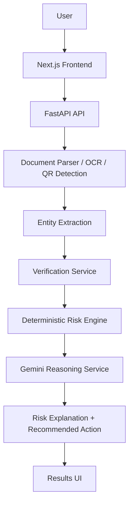

# UNMASK AI

> **See beyond the message. Verify the identity.**

UNMASK AI is an AI-powered cybersecurity verification platform that analyzes suspicious digital communications and helps users understand potential impersonation and scam signals through evidence-based verification.

UNMASK AI inspects digital artifacts—including PDF documents, screenshots, raster images, URLs, phone numbers, and QR codes—extracting structural evidence, cross-referencing contact and identity consistency, detecting social-engineering triggers, computing deterministic risk scores, and generating clear, evidence-backed security guidance powered by Google Gemini AI.


---

## 1. UNMASK AI Overview

UNMASK AI addresses the growing risk of digital impersonation and social-engineering attacks delivered via unstructured documents and digital media. Rather than providing an opaque binary classification ("safe" or "scam"), UNMASK AI provides a transparent breakdown of extracted evidence, identity mismatches, risk severity scoring, and actionable safety recommendations.

---

## 2. Problem

Modern digital communications—such as PDF invoices, payment receipts, notification screenshots, scanned notices, and image attachments—are primary vectors for phishing and impersonation attacks.

Key challenges in digital threat analysis include:
* **Multi-Format Delivery**: Threats arrive across PDFs, screenshots, image files, embedded QR codes, web URLs, and phone numbers.
* **Organizational Impersonation**: Attackers masquerade as legitimate financial institutions, delivery services, and service providers using official logos and brand names.
* **Embedded Evidence**: Critical risk indicators—such as support phone numbers, domain URLs, and QR code destinations—are embedded inside documents and images rather than plain body text.
* **Inadequate Binary Classifications**: Simple "scam / not scam" outputs lack contextual evidence, verification proof, and user trust.
* **Lack of Actionable Guidance**: Users require clear evidence and a safer recommended next step to avoid taking harmful action.

---

## 3. Solution

UNMASK AI structures digital threat verification around a four-stage security framework:

$$\text{Evidence} \longrightarrow \text{Verification} \longrightarrow \text{Explanation} \longrightarrow \text{Action}$$

The system performs automated analysis across five core layers:
1. **Evidence Extraction**: Parses text, phone numbers, URLs, and embedded QR codes from documents and images.
2. **Consistency Verification**: Cross-references extracted contact numbers and web domains against reference identity data.
3. **Signal Detection**: Identifies social-engineering patterns such as urgency language, credential prompts, and direct payment requests.
4. **Deterministic Risk Scoring**: Computes an objective risk score and categorizes risk into `SAFE`, `SUSPICIOUS`, or `HIGH RISK`.
5. **AI-Powered Explanation & Guidance**: Uses Google Gemini AI to synthesize evidence into non-technical explanations and concrete recommended actions.

---

## 4. Key Features

* **Multi-Format Document Processing**: Analyzes digital PDF documents and common image formats (`PNG`, `JPG`, `JPEG`).
* **OCR Text Extraction**: Employs Tesseract OCR to extract text from scanned documents, screenshots, and rasterized images.
* **PDF Structural Parsing**: Uses PyMuPDF (`fitz`) for fast, native text extraction from digital PDF documents.
* **Phone Number Extraction & Verification**: Parses global contact numbers and checks consistency against registered organization contacts.
* **URL & Domain Analysis**: Extracts embedded links, parses hostnames, and checks domain consistency and structural anomalies.
* **QR Code Detection & Parsing**: Uses OpenCV (`cv2`) to detect and decode single or multi-QR code destinations embedded in media.
* **Organization & Entity Extraction**: Identifies claimed organization names from document headers and body text.
* **Social-Engineering Detection**: Detects high-pressure urgency framing, account credential verification prompts, and payment transfer requests.
* **Deterministic Risk Engine**: Evaluates rule-based logic to score severity without relying on AI model outputs for risk categorization.
* **Gemini AI Evidence Explanation**: Generates structured, human-readable security reports, key findings, and recommended next steps using the Google Gemini API.
* **Standardized Risk Levels**: Classifies analyzed communications into clear `SAFE`, `SUSPICIOUS`, and `HIGH RISK` categories.
* **Neutral Handling of Unknown Entities**: Marks unlisted entities as `UNVERIFIED` rather than assuming malice without supporting evidence.
* **Resilient AI Provider Architecture**: Includes a local mock reasoning provider for offline testing and automatic fallback when an API key is unconfigured.
* **Interactive Frontend Dashboard**: Next.js user interface featuring interactive dropzones, verification breakdown matrices, link analysis tables, and scan history logs.

---

## 5. How It Works

### Analysis Pipeline

1. **Input**: The user uploads a PDF document or image file (`PNG`, `JPG`, `JPEG`) through the web dashboard or API.
2. **Text & Evidence Extraction**: Native PDF text is extracted via PyMuPDF; image text is extracted via Tesseract OCR; QR codes are decoded using OpenCV.
3. **Contact / URL / QR Parsing**: Regex and parsing services isolate phone numbers, URLs, domain names, and QR destinations.
4. **Verification**: Extracted entities are cross-checked against reference registry data.
5. **Risk Scoring**: The deterministic risk engine evaluates rules (contact mismatches, domain mismatches, lookalike patterns, urgency triggers) to compute a score.
6. **Gemini AI Reasoning**: Structured evidence payloads are transmitted to Gemini AI (or the local fallback provider) to generate a clear security summary.
7. **Recommended Action**: Actionable guidance is displayed to assist the user in handling the communication safely.

---

## 6. System Architecture



### Module Responsibilities

* **`document_parser.py`**: Manages PyMuPDF PDF parsing and coordinates image conversion for OCR.
* **`ocr_service.py`**: Interacts with the Tesseract OCR executable to extract text from images.
* **`qr_service.py`**: Executes OpenCV `QRCodeDetector` routines to extract embedded QR destinations.
* **`entity_extractor.py`**: Parses phone numbers, web URLs, social-engineering keywords, and organization names.
* **`verification_service.py`**: Cross-checks extracted contact items against identity reference data.
* **`risk_engine.py`**: Evaluates deterministic security rules and computes the final risk level and payload.
* **`ai_reasoning_service.py`**: Interfaces with the Google Gemini API (`google-genai` SDK) to produce human-readable security assessments.

---

## 7. Risk Assessment

The deterministic risk engine evaluates rule-based indicators to compute objective risk scores:

| Category | Indicator / Trigger | Score Weight |
| :--- | :--- | :--- |
| **Contact Mismatch** | Extracted phone number conflicts with official organization contact | +3 |
| **Domain Mismatch** | Extracted domain conflicts with official organization domain | +3 |
| **QR Destination Mismatch** | QR code destination URL conflicts with official organization domain | +3 |
| **Lookalike Domain** | Domain resembles official domain with subtle variations | +2 |
| **Payment / Transfer Request** | Document prompts for direct wire transfer or financial payment | +2 |
| **Credential Request** | Document prompts for password or account credential confirmation | +2 |
| **Urgency Framing** | High-pressure language demanding immediate recipient action | +1 |
| **URL Structural Anomaly** | Hostname uses IP address, excessive subdomains, or suspicious TLD | +1 |
| **Verified Contact** | Phone number matches official registered organization contact | -1 |
| **Verified Domain** | Domain matches official registered organization domain | -1 |
| **Verified QR** | QR destination matches official registered organization domain | -1 |

### Risk Categories

* **SAFE** (Score $\le 2$): Low-risk indicators; communication details align with reference parameters.
* **SUSPICIOUS** (Score $3 - 5$): Unverified links, urgency framing, or unconfirmed contact details present.
* **HIGH RISK** (Score $\ge 6$): Confirmed contact/domain mismatches, lookalike domain patterns, or coercive payment/credential demands.

> **Role of Gemini AI**: Google Gemini **does not** determine or alter the deterministic risk score or level. It receives structured evidence to provide transparent, non-technical explanations of the underlying findings.

---

## 8. Verification Philosophy

UNMASK AI applies four standardized status classifications to extracted entities:

* **VERIFIED**: Official reference data confirms that the extracted contact or domain matches the claimed organization.
* **MISMATCH**: The extracted phone number, domain, or QR destination explicitly conflicts with registered official details for the claimed entity.
* **SUSPICIOUS**: Multiple risk signals (such as urgency language or suspicious URL structures) are detected without matching reference credentials.
* **UNVERIFIED**: Insufficient reference data is available to confirm or disprove legitimacy.

> **"UNMASK AI does not treat unknown information as malicious."**

### Reference Registry Notice
The trusted organization registry (`backend/app/data/trusted_organizations.json`) in this repository is a **demo/local reference dataset** configured for testing and system evaluation. It does not represent a universal real-world identity authority.

---

## 9. AI Integration

The Google Gemini integration in UNMASK AI operates within strict architectural boundaries:

* **Structured Data Inputs**: Gemini receives structured JSON evidence payloads (extracted entities, verification states, social-engineering flags, risk scores) rather than raw uploaded files.
* **Validated JSON Output**: Gemini returns a validated JSON schema (`AIAssessment`) containing:
  * `headline`: Concise security status title.
  * `summary`: Overview of findings.
  * `key_findings`: Itemized list of security observations.
  * `confidence`: Assessment confidence level (`high`, `medium`, `low`).
  * `recommended_action`: Actionable next steps for the user.
  * `reasoning_basis`: Itemized evidence points supporting the explanation.
* **Server-Side Key Isolation**: Gemini API requests originate strictly from the backend server; API keys are never exposed to client-side code.
* **Resilient Fallback**: A local `MockReasoningProvider` executes automatically if `GEMINI_API_KEY` is omitted or unavailable.

*Architectural Scope Note*: UNMASK AI does **not** employ RAG (Retrieval-Augmented Generation), vector databases, autonomous agent loops, or direct raw file streaming into the Gemini model.

---

## 10. Technology Stack

### Frontend
* **Framework**: [Next.js](https://nextjs.org/) (v15.1)
* **UI Library**: [React](https://react.dev/) (v19.0)
* **Language**: [TypeScript](https://www.typescriptlang.org/) (v5.7)
* **Styling**: [Tailwind CSS](https://tailwindcss.com/) (v3.4) & Lucide Icons

### Backend
* **API Framework**: [FastAPI](https://fastapi.tiangolo.com/) (v0.115)
* **Web Server**: [Uvicorn](https://www.uvicorn.org/) (v0.30)
* **Language**: [Python](https://www.python.org/) (3.10+)
* **Data Validation**: [Pydantic](https://docs.pydantic.dev/) (v2.8) & `pydantic-settings`

### AI & Vision Processing
* **AI Model API**: [Google Gemini API](https://ai.google.dev/) (`google-genai` v2.0 SDK)
* **OCR Engine**: [Tesseract OCR](https://github.com/tesseract-ocr/tesseract) (`pytesseract`)
* **PDF Parser**: [PyMuPDF](https://pymupdf.readthedocs.io/) (`fitz`)
* **Computer Vision**: [OpenCV](https://opencv.org/) (`opencv-python-headless`) for QR detection
* **Image Utilities**: [Pillow](https://python-pillow.org/) (`PIL`)
* **Phone Parsing**: `phonenumbers`

---

## 11. Project Structure

```
UNMASK-AI/
├── backend/
│   ├── app/
│   │   ├── api/
│   │   │   └── routes/
│   │   │       └── scan.py
│   │   ├── core/
│   │   │   └── config.py
│   │   ├── data/
│   │   │   └── trusted_organizations.json
│   │   ├── models/
│   │   │   └── schemas.py
│   │   ├── services/
│   │   │   ├── ai_reasoning_service.py
│   │   │   ├── document_parser.py
│   │   │   ├── entity_extractor.py
│   │   │   ├── ocr_service.py
│   │   │   ├── qr_service.py
│   │   │   ├── risk_engine.py
│   │   │   ├── verification_provider.py
│   │   │   └── verification_service.py
│   │   └── main.py
│   ├── tests/
│   │   ├── test_ai_reasoning.py
│   │   ├── test_health.py
│   │   ├── test_ocr.py
│   │   ├── test_scan.py
│   │   └── test_verification.py
│   ├── .env.example
│   ├── README.md
│   └── requirements.txt
├── src/
│   ├── app/
│   │   ├── history/
│   │   ├── results/
│   │   ├── scan/
│   │   ├── settings/
│   │   ├── globals.css
│   │   ├── layout.tsx
│   │   └── page.tsx
│   ├── components/
│   │   ├── AIExplanation.tsx
│   │   ├── AnalysisProgress.tsx
│   │   ├── ContactVerification.tsx
│   │   ├── EmptyState.tsx
│   │   ├── EvidenceCard.tsx
│   │   ├── EvidenceList.tsx
│   │   ├── LinkAnalysis.tsx
│   │   ├── Navbar.tsx
│   │   ├── RecommendedAction.tsx
│   │   ├── RiskBadge.tsx
│   │   ├── RiskSummary.tsx
│   │   ├── ScanDropzone.tsx
│   │   └── ScanHistoryTable.tsx
│   ├── context/
│   ├── data/
│   ├── services/
│   └── types/
├── .env.example
├── next.config.mjs
├── package.json
├── tailwind.config.js
└── tsconfig.json
```

---

## 12. Getting Started

### Prerequisites

Ensure the following tools are installed in your environment:
* **Node.js**: v18.0 or higher
* **Python**: v3.10 or higher
* **Git**: latest
* **Tesseract OCR**: Recommended for image OCR processing ([UB-Mannheim Tesseract Releases](https://github.com/UB-Mannheim/tesseract/wiki)).
  * *Note: Text-based PDFs process natively without requiring Tesseract.*

### 1. Repository Setup

```bash
git clone https://github.com/varshithaaaagedda/UNMASK-AI.git
cd UNMASK-AI
```

### 2. Backend Setup

Navigate to the `backend` directory, create a virtual environment, and install dependencies:

```bash
cd backend

# Create virtual environment
python -m venv venv

# Activate virtual environment
# On Windows (PowerShell):
.\venv\Scripts\Activate.ps1
# On Linux / macOS:
source venv/bin/activate

# Install dependencies
pip install -r requirements.txt
```

Create a backend environment file by copying `.env.example`:

```bash
cp .env.example .env
```

Start the FastAPI development server:

```bash
uvicorn app.main:app --reload --port 8000
```

The API will be available at `http://localhost:8000`. Interactive OpenAPI documentation is accessible at `http://localhost:8000/docs`.

### 3. Frontend Setup

In a separate terminal, navigate to the project root and install Node dependencies:

```bash
# From project root
npm install

# Start Next.js development server
npm run dev
```

Open `http://localhost:3000` in your web browser to access the user interface.

---

## 13. Environment Variables

Backend configurations are defined in `backend/.env`:

| Variable Name | Description | Default / Example |
| :--- | :--- | :--- |
| `PROJECT_NAME` | Name of the backend service | `"UNMASK AI"` |
| `API_V1_STR` | Base path for API v1 endpoints | `"/api/v1"` |
| `CORS_ORIGINS` | Permitted CORS origins (JSON array string) | `["http://localhost:3000"]` |
| `TESSERACT_CMD` | Path to the Tesseract OCR executable | `"C:\\Program Files\\Tesseract-OCR\\tesseract.exe"` |
| `AI_REASONING_PROVIDER` | AI provider implementation (`"gemini"` or `"mock"`) | `"gemini"` |
| `GEMINI_API_KEY` | Google Gemini API key (server-side only) | `"your_api_key_here"` |

> **Security Reminder**: Never commit `.env` files or API credentials to public repositories. Version control rules in `.gitignore` ignore `.env` files automatically.

---

## 14. API Reference

### `GET /health`
Returns system operational status and OCR engine availability.

**Response Example**:
```json
{
  "status": "ok",
  "service": "UNMASK AI",
  "ocr": {
    "available": true,
    "engine": "tesseract",
    "version": "5.3.3.20231005",
    "error": null
  }
}
```

### `GET /api/v1/health/ocr`
Returns dedicated OCR engine status diagnostics.

**Response Example**:
```json
{
  "available": true,
  "engine": "tesseract",
  "executable": "C:\\Program Files\\Tesseract-OCR\\tesseract.exe",
  "version": "5.3.3.20231005",
  "error": null
}
```

### `POST /api/v1/scan`
Uploads a document or screenshot for security signal extraction and verification analysis.

* **Content-Type**: `multipart/form-data`
* **Form Field**: `file` (Binary file)
* **Supported Extensions**: `.pdf`, `.png`, `.jpg`, `.jpeg`

**Response Example**:
```json
{
  "scan_id": "scan-a1b2c3d4e5",
  "filename": "suspicious_notice.pdf",
  "file_type": "pdf",
  "risk_level": "high",
  "threat_type": "Potential Impersonation / High Risk",
  "summary": "UNMASK identified high-risk signals including contact or domain mismatches...",
  "ocr": {
    "available": true,
    "engine": "tesseract",
    "executable": "C:\\Program Files\\Tesseract-OCR\\tesseract.exe",
    "version": "5.3.3.20231005",
    "error": null
  },
  "extracted": {
    "text": "URGENT PAYMENT NOTICE from Northstar Financial...",
    "phone_numbers": ["+1 800 555 0199"],
    "urls": ["http://northstar-secure-login.com"],
    "qr_codes": ["http://northstar-secure-login.com/pay"]
  },
  "evidence": [
    {
      "title": "Phone contact mismatch",
      "severity": "high",
      "description": "Phone number +1 800 555 0199 does not match official reference for Northstar Financial.",
      "category": "contact"
    }
  ],
  "contact_verification": [
    {
      "claimed_organization": "Northstar Financial",
      "phone_found": "+1 800 555 0199",
      "verified_contact": "+91 1800 987 6543",
      "status": "mismatch",
      "details": "Phone number does not match official record."
    }
  ],
  "link_analysis": [],
  "verification": {
    "organization": {
      "entity": "Northstar Financial",
      "status": "verified",
      "evidence": "Organization recognized in local trusted registry."
    },
    "phones": [],
    "domains": [],
    "qr_codes": []
  },
  "recommendation": "Do not call the number or click links in this document.",
  "ai_assessment": {
    "headline": "Potential impersonation detected",
    "summary": "UNMASK found multiple signals that conflict with the claimed organization...",
    "key_findings": [
      "Phone number does not match trusted contact associated with Northstar Financial."
    ],
    "confidence": "high",
    "recommended_action": "Verify through official independently sourced channels.",
    "reasoning_basis": [
      "Phone number does not match trusted organization contact."
    ]
  }
}
```

---

## 15. Testing

The backend suite includes unit and integration tests covering OCR diagnostic routines, document parsing, risk scoring, verification services, and AI fallback behavior.

To run the backend tests:

```bash
cd backend
python -m pytest tests/
```

**Test Suite Status**: **32 passed** tests.

---

## 16. Security & Privacy

* **Server-Side Secret Management**: Gemini API keys are processed strictly on the FastAPI server and are never exposed to client browsers.
* **Structured Data Transmission**: Only structured evidence data (extracted strings, verification flags, risk metrics) is transmitted to AI reasoning providers.
* **Local Processing**: Document parsing, text extraction, OCR, and QR decoding occur within the local backend environment.
* **Assistive System Scope**: UNMASK AI is designed as an assistive verification platform to aid user decision-making and should not be used as an absolute security authority.

---

## 17. Current Limitations

* **Demo Registry Dataset**: Identity verification relies on a local demo dataset (`trusted_organizations.json`).
* **No Live Threat Intelligence Feeds**: External threat databases (such as VirusTotal or Google Safe Browsing APIs) are not currently integrated.
* **No Live Voice / Deepfake Detection**: Audio and video analysis features are outside the current system release scope.
* **Neutral Stance on Unknown Entities**: Unknown phone numbers, web domains, and entities are marked `UNVERIFIED` rather than automatically assumed malicious.
* **Production Deployment Requirements**: Full enterprise deployment requires adding rate limiting, persistent database storage, user authentication, and TLS configuration.

---

## 18. Future Roadmap

* **External Threat Intelligence**: Integration with VirusTotal, Safe Browsing, and WHOIS domain age lookup services.
* **Scaled Organization Registry**: Integration with global identity databases and commercial registry APIs.
* **Advanced Domain Intelligence**: Homograph and typosquatting detection algorithms.
* **Advanced Visual Document Inspection**: Layout analysis for detecting manipulated logos and typography anomalies.
* **Voice & Deepfake Verification**: Optional modules for analyzing audio files and call media.
* **Enterprise Security Infrastructure**: Persistent storage, user access controls, API rate limiting, and audit logging.
* **Browser & Webmail Extensions**: Real-time verification popups for web browser and email workflows.

---

## 19. Demo

To evaluate the UNMASK AI workflow:

$$\text{Upload Document} \longrightarrow \text{Extract Evidence} \longrightarrow \text{Detect Mismatches} \longrightarrow \text{Evaluate Risk} \longrightarrow \text{Gemini Explanation} \longrightarrow \text{Safer Action}$$

1. Open the **Scan** section in the web application (`http://localhost:3000/scan`).
2. Upload a sample PDF or image notice (e.g., a document claiming to originate from "Northstar Financial").
3. View real-time progress as document text is parsed, OCR is performed, and entities are extracted.
4. Inspect the **Risk Summary**, **Evidence Cards**, **Contact Verification Matrix**, and **Link Analysis Breakdown**.
5. Read the **Gemini AI Explanation** for an evidence-backed summary of the security signals.
6. Review the **Recommended Action** before taking any action regarding the communication.

---

## 20. License

This project is licensed under the [MIT License](LICENSE).

---

**Built with a focus on evidence, transparency, and safer digital decisions.**
